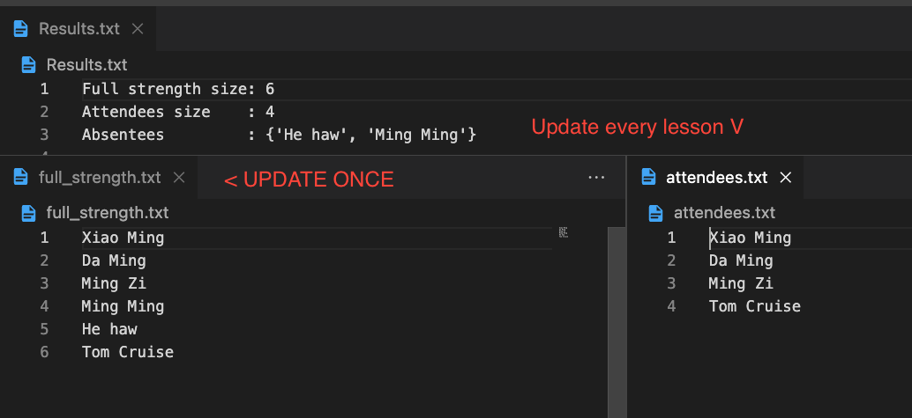

Check Attendance
=================

This is a simple script that can be used to check attendance.

## One Picture Explanation

Background
----------

The script uses a set to quickly compare the full class list to the list of attendees and determine who is absent.

How to Use
----------

1. Update the `full_strength.txt` file to include the full class list.
2. Update the `attendees.txt` file to include the list of attendees.
3. Run the `checker.py` script to view the output.
4. View the attendees in the Results.txt to see who is absent.

The output will include the total number of students, the number of attendees, and a list of absentees.

Note: Both `full_strength.txt` and `attendees.txt` should be tab-separated files with only one column containing the student names.

Tips
----

To easily convert an image of text (such as an attendance sheet) to a text file that can be used with this script, you can use an OCR (Optical Character Recognition) tool. One example is the [Microsoft Office Lens](https://www.microsoft.com/en-us/microsoft-365/microsoft-office-lens-mobile-pdf-scanner-app) app, which can be used to take a picture of the attendance sheet and convert it to a searchable PDF or Word document.
